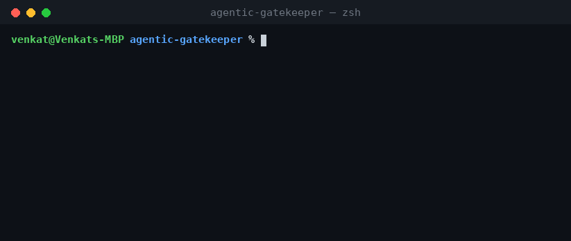

# agentic-gatekeeper

**Audit GKE workloads against OPA/Gatekeeper policies — and preview the blast
radius of a new one before you enforce it.** It answers two questions from a
plain `kubectl -o json` dump: *what violates the policies we enforce today*, and
*if we flip this constraint from dry-run to deny, which apps break and why?*

<p>
  
  
  
</p>




> Modeled on the policy-as-code guardrails I run in production with OPA
> Gatekeeper and `gator`. It's the offline evaluator idea — test policy against
> manifests without a live admission webhook — turned into an agent skill.

**One skill, one engine.** A thin Claude **skill** ([`SKILL.md`](SKILL.md))
orchestrates — load the dump, run the audit or the what-if, explain the
violations, propose fixes. The deterministic policy matching runs in a Python
**engine** (`src/gatekeeper_guard/`). The model does the explaining and the
fix suggestions; the engine does the matching. Nobody burns tokens parsing
manifests by hand.

---

## Why this exists

Gatekeeper tells you *no* at admission time — which is the worst time to find
out a policy breaks half your namespace. Two gaps hurt teams:

1. **Existing drift.** Constraints get added, but resources that predate them
   keep running. What's actually violating policy right now?
2. **Change risk.** Someone proposes a stricter policy — "all images must be
   semver," "every workload needs an owner label." Flip it to `deny` and you
   might block tomorrow's deploys across a dozen teams. You want that list
   *before* you merge, not after the pager goes off.

This engine covers both: an **audit** of live violations, and a **what-if** that
runs a candidate constraint across the fleet and tells you exactly which
workloads would fail and why.

## Policies in the catalog

| Policy | Enforcement | Rule |
| --- | --- | --- |
| `image-valid-semver` | deny | image tags must be valid `X.Y.Z` semver, never `:latest` (digests OK) |
| `require-probes` | deny | Deployments/StatefulSets/DaemonSets need liveness **and** readiness probes |
| `backendconfig-has-securitypolicy` | deny | every `BackendConfig` must reference a Cloud Armor security policy |
| `service-has-backendconfig-annotation` | deny | Services must carry the `cloud.google.com/backend-config` annotation |
| `require-owner-label` | dry-run | workloads must have a `team` ownership label *(what-if candidate)* |
| `require-resource-limits` | dry-run | containers must set CPU/memory requests and limits *(what-if candidate)* |

Adding a policy is one check function plus one entry in the catalog — see
[`references/policies.md`](references/policies.md).

## Quickstart

Runs offline against a bundled sample cluster dump — no cluster needed.

```bash
git clone https://github.com/venkat-mandadi/agentic-gatekeeper
cd agentic-gatekeeper
pip install -e ".[dev]"

python examples/run_audit.py                                        # audit + all what-ifs
gatekeeper-check examples/resources.json audit                      # just the audit
gatekeeper-check examples/resources.json whatif require-owner-label # one what-if
gatekeeper-check examples/resources.json whatif --all               # every candidate
gatekeeper-check examples/resources.json policies                   # list the catalog
```

Point it at your own cluster: `kubectl get deploy,svc,backendconfig -A -o json > cluster.json`
then `gatekeeper-check cluster.json audit`.

### Sample output

```
❌ 5 violation(s) across 4 resource(s):
Deployment/catalog-prod/catalog-web
    [image-valid-semver] container 'web' image 'nginx:latest' uses the ':latest' tag
        fix: Pin the image to an immutable X.Y.Z tag (or a digest) instead of ':latest'.
    [require-probes] container 'web' is missing readinessProbe
        fix: Add livenessProbe and readinessProbe to each container.
...

WHAT-IF: enforce 'require-owner-label'
  Workloads must carry a 'team' ownership label.
  ⚠️  3 of 4 applicable resource(s) would start failing admission.
  by namespace — analytics-prod: 1, catalog-prod: 1, legacy-prod: 1
  affected:
    - Deployment/analytics-prod/analytics: workload is missing the required 'team' label
    ...
```

## Running it as an agent

**As a Claude skill.** Drop the folder into your skills directory (or install
the packaged `.skill`). It triggers on Gatekeeper/OPA/policy/admission requests,
runs `scripts/gatekeeper_check.py`, and reports violations or impact — never
pulling raw manifests into the model's context. See [`SKILL.md`](SKILL.md).

**As an MCP tool:**

```bash
pip install -e ".[mcp]"
python -m gatekeeper_guard.mcp_server examples/resources.json
```

Tools: `audit()`, `what_if(policy)`, `what_if_all_candidates()`,
`list_policies()`, `audit_report(fmt)`.

## Design decisions

- **Same evaluator for audit and what-if.** The only difference is which
  constraints run — enforced ones for audit, a candidate for what-if. One code
  path, so a preview matches reality.
- **Every violation is fixable, not just flagged.** Each carries a concrete
  remediation and the exact field at fault — "the policy said no" is useless at
  3 a.m.
- **Registry ports and digests are handled.** `reg:5000/app:v1.0.0` isn't a bad
  tag, and an immutable `@sha256:` digest is acceptable — the semver check
  doesn't false-positive on them.
- **The engine is pure and tested.** Policy logic has zero dependency on `mcp` or
  a live cluster, so the decisions are deterministic and unit-tested.

## Wiring real data

- **Resources:** `kubectl get <kinds> -A -o json` (or a manifest bundle). The
  loader takes a `List`, a single object, or an array; YAML too with
  `pip install -e ".[yaml]"`.
- **Policies:** the catalog mirrors your ConstraintTemplates. Point it at your
  real set, or generate `Constraint` entries from your Rego/CRDs.

## Roadmap

- [ ] Import live Gatekeeper `Constraint` CRDs directly (mirror enforcement state)
- [ ] Rego evaluation for policies expressed in native OPA
- [ ] Emit a PR comment when a proposed constraint would break workloads
- [ ] Waiver/exemption handling (annotated opt-outs)

## Tests

```bash
pytest -q      # per-policy checks + audit + what-if impact
```

## License

MIT — see [LICENSE](LICENSE).
