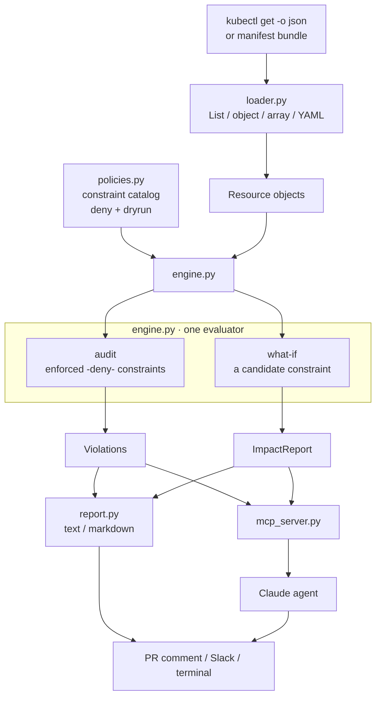

# Architecture

Layered so the **policy logic** is pure and testable and the **agent surface**
(skill / MCP) is a thin adapter. An LLM never evaluates raw manifests — it calls
tools that return compact, fixable violations.

## Why this shape

**One evaluator, two questions.** `audit` and `what-if` both call
`evaluate_one`; the only difference is which constraints run — the enforced
(`deny`) set for an audit, a single candidate for a what-if. That's what makes a
preview trustworthy: it exercises the exact same code path enforcement would.

**Policies are data, checks are pure functions.** Each constraint is a small
function returning violation messages, plus metadata (target kinds, description,
fix). Adding one is a function and a catalog entry — no engine changes — and
every check is unit-tested against compliant and violating inputs.

**Enforcement state is first-class.** A constraint carries `deny` / `warn` /
`dryrun`. Audit only reports what's actually enforced; what-if is explicitly a
preview of a not-yet-enforced constraint, so results are never mistaken for live
denials.

**Violations are actionable.** Each names the resource, the exact field at
fault, and a concrete fix — because these end up in a pull request or an
incident channel, where a bare "denied by policy" wastes everyone's time.
